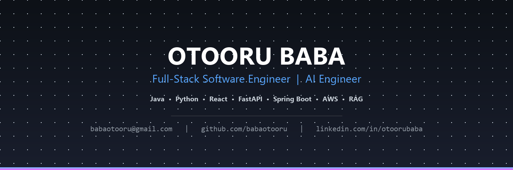

<!-- ═══════════════════════════════════════════════════════════════════════════════ -->
<!-- GITHUB PROFILE README — OTOORU BABA                                         -->
<!-- Enterprise-Quality | Dark Theme | Glassmorphism Aesthetic                    -->
<!-- ═══════════════════════════════════════════════════════════════════════════════ -->

<!-- BANNER -->
<div align="center">
  
</div>

<!-- ANIMATED TYPING SVG -->
<div align="center">
  <a href="https://github.com/babaotooru">
    
  </a>
</div>

<br/>

<!-- PROFILE BADGES -->
<div align="center">
  <a href="https://linkedin.com/in/otoorubaba"></a>&nbsp;
  <a href="https://github.com/babaotooru"></a>&nbsp;
  <a href="https://leetcode.com/u/babaotooru/"></a>&nbsp;
  <a href="https://baba-otooru-portfolio.vercel.app"></a>&nbsp;
  <a href="mailto:babaotooru@gmail.com"></a>
</div>

<div align="center">
  
</div>

<br/>

<!-- ═══════════════════════════════════════════════════════════════════════════════ -->
<!-- ABOUT ME                                                                      -->
<!-- ═══════════════════════════════════════════════════════════════════════════════ -->

##  &nbsp;About Me


I'm **Otooru Baba**, a passionate Full-Stack Software Engineer and Computer Science graduate. I specialize in building, testing, and maintaining scalable systems end-to-end, with production experience spanning **Java, Python, JavaScript, and TypeScript**.

I thrive at the intersection of clean software engineering and intelligent systems — whether it's architecting backends with Spring Boot, designing AI-powered RAG applications with FastAPI and Llama 3.1, or optimizing PostgreSQL and Redis cache layers for low latency.

- &nbsp; **B.Tech in Computer Science & Engineering** — Kalasalingam Academy of Research and Education, Class of 2025
- &nbsp; Full-Stack focus with deep expertise in **Java/Spring Boot** and **Python/FastAPI**
- &nbsp; Experienced in **Generative AI, RAG pipelines, and Vector Search (FAISS)**
- &nbsp; Open to **Full-Stack Software Engineer, AI Engineer, Backend Engineer, and Java/Python Developer** roles
- &nbsp; Passionate about writing clean, testable code aligned with **SOLID principles and system design patterns**

<br clear="right"/>

---

<!-- ═══════════════════════════════════════════════════════════════════════════════ -->
<!-- CAREER OBJECTIVE                                                              -->
<!-- ═══════════════════════════════════════════════════════════════════════════════ -->

## &nbsp;Career Objective

> *Driven by a deep passion for software engineering, I aim to contribute to teams building impactful products at scale. With strong foundations in backend systems, full stack engineering, and a growing expertise in AI/LLM integration, I continuously seek to learn modern technologies, write clean and maintainable code, and deliver solutions that genuinely solve real-world problems. I'm looking for an opportunity where I can grow as an engineer while creating high-quality, testable, and community-impacting software.*

---

<!-- ═══════════════════════════════════════════════════════════════════════════════ -->
<!-- EDUCATION                                                                     -->
<!-- ═══════════════════════════════════════════════════════════════════════════════ -->

## &nbsp;Education

<table>
<tr>
<td width="80" align="center">
  
</td>
<td>
  <strong>Kalasalingam Academy of Research and Education</strong><br/>
  Bachelor of Technology — Computer Science & Engineering (CGPA: 8.3 / 10.0)<br/>
  <sub>2021 – 2025</sub>
</td>
</tr>
</table>

---

<!-- ═══════════════════════════════════════════════════════════════════════════════ -->
<!-- EXPERIENCE TIMELINE                                                           -->
<!-- ═══════════════════════════════════════════════════════════════════════════════ -->

## &nbsp;Experience & Training

```
┌─────────────────────────────────────────────────────────────────────┐
│                                                                     │
│  ◆  Novacode — Web Development & Generative AI Trainee             │
│  │  ▸ Wrote & shipped full-stack product code across 5+ project     │
│  │    cycles using Java backends and JavaScript/React frontends.    │
│  │  ▸ Participated in design reviews, evaluating architectural      │
│  │    trade-offs for testability and maintainability.               │
│  │  ▸ Conducted code reviews, resolving 20+ issues spanning        │
│  │    accuracy, edge cases, and performance best practices.         │
│  │  ▸ Triaged and debugged backend, rendering, and API contract     │
│  │    issues end-to-end.                                            │
│  │                                                                   │
│  ◆  AWS Solutions Architecture Job Simulation — Forage              │
│  │  ▸ Evaluated cloud architectural requirements and trade-offs.     │
│  │  ▸ Designed secure, scalable, and highly available architectures.│
│                                                                     │
└─────────────────────────────────────────────────────────────────────┘
```

---

<!-- ═══════════════════════════════════════════════════════════════════════════════ -->
<!-- CERTIFICATIONS                                                                -->
<!-- ═══════════════════════════════════════════════════════════════════════════════ -->

## &nbsp;Certifications

<div align="center">
<table>
<tr>
<td align="center" width="400">
  <br/><br/>
  <strong>Solutions Architecture Job Simulation</strong><br/>
  <sub>Forage</sub><br/>
  <sub>Cloud Architecture · Security · Scalability · System Design</sub>
</td>
<td align="center" width="400">
  <br/><br/>
  <strong>Web Development & Generative AI</strong><br/>
  <sub>Novacode</sub><br/>
  <sub>React · Java · Spring Boot · LLM Integration · Code Quality</sub>
</td>
</tr>
<tr>
<td align="center" width="400">
  <br/><br/>
  <strong>Cloud Infrastructure Certified</strong><br/>
  <sub>Oracle</sub><br/>
  <sub>OCI Services · Cloud Security · Core Compute & Networking</sub>
</td>
<td align="center" width="400">
  <br/><br/>
  <strong>Linear Regression with NumPy</strong><br/>
  <sub>Coursera</sub><br/>
  <sub>Mathematical Foundations · Supervised Learning · NumPy</sub>
</td>
</tr>
</table>
</div>

---

<!-- ═══════════════════════════════════════════════════════════════════════════════ -->
<!-- TECH STACK                                                                    -->
<!-- ═══════════════════════════════════════════════════════════════════════════════ -->

## &nbsp;Tech Stack

<div align="center">

### Languages


### Frontend & Full-Stack


### Backend & Frameworks


### Databases & Caching


### Developer Tools & Cloud


### AI / ML & System Design


</div>

---

<!-- ═══════════════════════════════════════════════════════════════════════════════ -->
<!-- FEATURED PROJECTS                                                             -->
<!-- ═══════════════════════════════════════════════════════════════════════════════ -->

## &nbsp;Featured Projects

<div align="center">

<!-- ROW 1 -->
<table>
<tr>
<td width="50%" valign="top">

###  Online Coding Judge System
A large-scale, full-stack coding platform featuring secure sandboxed code execution, evaluation systems, and concurrent submission handlers.

**Key Features:** Java/Spring Boot backend, React + Monaco Editor, PostgreSQL, Redis caching (reduced P95 response latency by ~40%), JUnit testing, Swagger docs, Docker Compose.


<a href="https://github.com/babaotooru/Online-Coding-Judge-System"></a>

</td>
<td width="50%" valign="top">

###  AI Shopping Assistant – Chatbot
A production-grade full-stack AI chatbot integrating a RAG pipeline for context-aware product recommendations across 500+ datasets.

**Key Features:** RAG pipeline (FAISS vector search + transformer embeddings), Llama 3.1 LLM integration, modular versioned REST APIs, FastAPI backend, React/TypeScript.


<a href="https://github.com/babaotooru/AI-Shopping-Assistant"></a>

</td>
</tr>
</table>

<!-- ROW 2 -->
<table>
<tr>
<td width="50%" valign="top">

###  Brain Tumor Detection System
A large-scale data pipeline and deep learning application for MRI image preprocessing, augmentation, and classification.

**Key Features:** CNN inference engine achieving **95%+ classification accuracy** across 4 tumor categories, batch normalization, cross-validation, systematic data analysis.


<a href="https://github.com/babaotooru/Brain-Tumor-Detection-System"></a>

</td>
<td width="50%" valign="top">

###  Medicinal Plant Identification Platform
An end-to-end full-stack classification system enabling real-time identification of plant species from image inputs.

**Key Features:** CNN inference backend exposed via a REST API, Streamlit frontend (HTML/CSS) for real-time classification across 30+ plant species, interactive UI.


<a href="https://github.com/babaotooru/Medicinal-Plant-Identification-Platform"></a>

</td>
</tr>
</table>

</div>

---

<!-- ═══════════════════════════════════════════════════════════════════════════════ -->
<!-- CURRENTLY LEARNING                                                            -->
<!-- ═══════════════════════════════════════════════════════════════════════════════ -->

## &nbsp;Currently Learning & Expanding

<div align="center">


</div>

---

<!-- ═══════════════════════════════════════════════════════════════════════════════ -->
<!-- GITHUB ANALYTICS                                                              -->
<!-- ═══════════════════════════════════════════════════════════════════════════════ -->

## &nbsp;GitHub Analytics

<div align="center">

<!-- Stats & Languages Side by Side -->
<a href="https://github.com/babaotooru">
  
</a>&nbsp;&nbsp;
<a href="https://github.com/babaotooru">
  
</a>

<br/><br/>

<!-- Streak Stats -->
<a href="https://github.com/babaotooru">
  
</a>

<br/><br/>

<!-- Activity Graph -->
<a href="https://github.com/babaotooru">
  
</a>

<br/><br/>

<!-- GitHub Trophies -->
<a href="https://github.com/babaotooru">
  
</a>

</div>

---

<!-- ═══════════════════════════════════════════════════════════════════════════════ -->
<!-- CONTRIBUTION SNAKE                                                            -->
<!-- ═══════════════════════════════════════════════════════════════════════════════ -->

## &nbsp;Contribution Graph

<div align="center">
  <picture>
    <source media="(prefers-color-scheme: dark)" srcset="https://raw.githubusercontent.com/babaotooru/babaotooru/output/github-snake-dark.svg" />
    <source media="(prefers-color-scheme: light)" srcset="https://raw.githubusercontent.com/babaotooru/babaotooru/output/github-snake.svg" />
    
  </picture>
</div>

> **Setup:** To enable the snake animation, add the [GitHub Snake workflow](.github/workflows/snake.yml) to your profile repository. See the [Upload Guide](./UPLOAD_GUIDE.md) for instructions.

---

<!-- ═══════════════════════════════════════════════════════════════════════════════ -->
<!-- OPTIONAL SECTIONS                                                             -->
<!-- ═══════════════════════════════════════════════════════════════════════════════ -->

## &nbsp;Achievements & Highlights

- Designed and built a **large-scale Coding Judge Platform** featuring concurrent submission execution and sandbox environments.
- Architected and shipped a production-ready **AI Shopping Assistant** with RAG pipeline (FAISS + Llama 3.1) from scratch.
- Implemented and evaluated a **Brain Tumor Detection CNN model** yielding **95%+ classification accuracy**.
- Completed a 10-week **Web Development & Generative AI Trainee program** at Novacode.
- Graduated B.Tech in CSE with a **CGPA of 8.3/10.0** from Kalasalingam Academy of Research and Education.

---

## &nbsp;Development Workflow

<div align="center">

```
  Ideate  →  Design  →  Develop  →  Test  →  Deploy  →  Iterate
    💡         📐         💻        🧪       🚀         🔄
```

</div>

| Category | Tools / Setup |
|---|---|
| **IDE** | IntelliJ IDEA, VS Code |
| **Version Control** | Git, GitHub |
| **Testing & API Debugging** | JUnit, Postman, Swagger |
| **Containerization** | Docker, Docker Compose |
| **OS** | Windows, Linux |
| **Languages** | English, Telugu, Hindi |

---

## &nbsp;Fun Facts

- I write backend code for fun — REST APIs and concurrency design are my comfort zones.
- I optimized a PostgreSQL and Redis caching layer to slash response times by **~40%** in my coding judge project.
- I believe **clean architecture** and **separation of concerns** are as important as compiling code.
- My debugging mantra: *"If it works, don't touch it. If it doesn't, refactor the service layer."*
- Currently on a mission to build autonomous workflows using **Agentic AI**.

---

## &nbsp;Daily Learning

```python
class OtooruBaba:
    def __init__(self):
        self.name = "Otooru Baba"
        self.role = "Full-Stack Software Engineer & AI Engineer"
        self.languages = ["Java", "Python", "JavaScript", "TypeScript", "SQL"]
        self.interests = ["Full-Stack Dev", "AI/ML (RAG/LLMs)", "System Design"]
        self.currently_learning = ["AWS Solutions Architecture", "Agentic AI", "Kubernetes"]
        self.open_to = ["Software Engineer", "Full-Stack Engineer", "AI Engineer", "Backend Developer"]
        self.fun_fact = "I optimize database queries and caching layers for fun."

    def say_hi(self):
        print("Thanks for dropping by! Let's build something extraordinary together.")

me = OtooruBaba()
me.say_hi()
```

---

## &nbsp;Open Source Goals

- Contribute to **Spring Boot** and **FastAPI** ecosystems.
- Build and publish open-source **RAG & Agentic utilities** for developer communities.
- Design beginner-friendly boilerplate repositories with secure authentication.
- Share knowledge through well-documented, highly-architected repositories.
- Collaborate on open projects solving scalability challenges.

---

<!-- ═══════════════════════════════════════════════════════════════════════════════ -->
<!-- CONNECT                                                                       -->
<!-- ═══════════════════════════════════════════════════════════════════════════════ -->

## &nbsp;Let's Connect

<div align="center">

<a href="https://linkedin.com/in/otoorubaba"></a>&nbsp;&nbsp;
<a href="https://github.com/babaotooru"></a>&nbsp;&nbsp;
<a href="https://leetcode.com/u/babaotooru/"></a>&nbsp;&nbsp;
<a href="mailto:babaotooru@gmail.com"></a>

</div>

---

<!-- ═══════════════════════════════════════════════════════════════════════════════ -->
<!-- TECH QUOTE                                                                    -->
<!-- ═══════════════════════════════════════════════════════════════════════════════ -->

<div align="center">
  
</div>

---

<!-- ═══════════════════════════════════════════════════════════════════════════════ -->
<!-- FOOTER                                                                        -->
<!-- ═══════════════════════════════════════════════════════════════════════════════ -->

<div align="center">
  
</div>

<div align="center">
  <sub>Thank you for visiting my GitHub profile. Let's build something extraordinary together.</sub>
  <br/>
  <sub>Made with dedication and a lot of passion.</sub>
  <br/><br/>
  <a href="https://github.com/babaotooru"></a>
</div>
